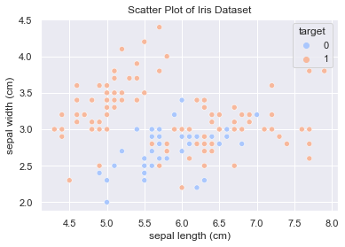
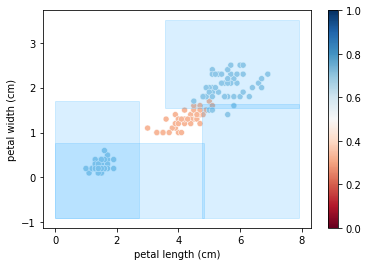
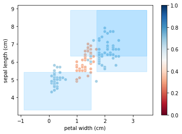

# InsideForest

InsideForest is a **supervised clustering** technique built on decision forests to identify and describe categories within a dataset. It discovers relevant regions, assigns labels and produces interpretable descriptions.

*Supervised clustering* groups observations using the target variable to guide segmentation. Instead of letting the algorithm find groups on its own, existing labels steer the search for coherent patterns.

Whether you work with customer data, sales or any other source, the library helps you understand your information and make informed decisions.

## Example use cases

- Analyze customer behavior to identify profitable segments.
- Classify patients by medical history and symptoms.
- Evaluate marketing channels using website traffic.
- Build more accurate image-recognition systems.

## Benefits

Building and analyzing a random forest with InsideForest uncovers hidden trends and provides **insights** that support business decisions.

[USE CASE](https://colab.research.google.com/drive/11VGeB0V6PLMlQ8Uhba91fJ4UN1Bfbs90?usp=sharing)

## Installation

```bash
pip install InsideForest
```

## Main dependencies
- scikit-learn
- numpy
- pandas
- matplotlib
- seaborn
- openai

## Basic workflow
The typical order for applying InsideForest is:
1. Train a decision forest or `RandomForest` model.
2. Use `Trees.get_branches` to extract each tree's branches.
3. Apply `Regions.prio_ranges` to prioritize areas of interest.
4. Link each observation with `Regions.labels`.
5. Optionally interpret results with `generate_descriptions` and `categorize_conditions`.
6. Finally, use helpers such as `Models` and `Labels` for further analysis.

## Use case (Iris)
The following summarizes the flow used in the [example notebook](https://colab.research.google.com/drive/11VGeB0V6PLMlQ8Uhba91fJ4UN1Bfbs90?usp=sharing).

### 1. Model preparation

```python
from pyspark.sql import SparkSession
from sklearn.datasets import load_iris
from pyspark.ml.feature import VectorAssembler, StringIndexer
from pyspark.ml.classification import RandomForestClassifier

spark = SparkSession.builder.appName('Iris').getOrCreate()

# Load data into Spark
iris = load_iris()
df = pd.DataFrame(iris.data, columns=iris.feature_names)
df['species'] = iris.target
```

```python
import seaborn as sns
import matplotlib.pyplot as plt

sns.scatterplot(x=df.columns[0], y=df.columns[1], hue='species', data=df,
                palette='coolwarm')
plt.show()
```



```python
from InsideForest import Trees, Regions, Labels
treesSP = Trees('pyspark', n_sample_multiplier=0.05, ef_sample_multiplier=10)
regions = Regions()
labels = Labels()
```

### 2. Obtaining branches and clusters

```python
pyspark_mod = treesSP.get_branches(df, 'species', model)
priority_ranges = regions.prio_ranges(pyspark_mod, df)
clusterized, descriptive = regions.labels(df, priority_ranges, False)
```

### 3. Visualization

```python
for range_df in priority_ranges[:3]:
    if len(range_df['linf'].columns) > 3:
        continue
    regions.plot_multi_dims(range_df, df, 'species')
```





The blue areas highlight the most relevant branches of the forest, revealing where the target variable concentrates.

### `Models`

```python
from InsideForest.models import Models

m = Models()
fp_rows, rest = m.get_knn_rows(df_train, 'target', criterio_fp=True)
param_grid = {'n_estimators': [50, 100], 'max_depth': [None, 5]}
cv_model = m.get_cvRF(X_train, y_train, param_grid)
```

Provides methods for retrieving critical observations with KNN and tuning a random forest with cross-validation.

### `Labels`

```python
from InsideForest.labels import Labels

lb = Labels()
labels_out = lb.get_labels(priority_ranges, df, 'target', max_labels=5)
```

Generates descriptive labels for the branches and clusters obtained from the model.

## License

This project is distributed under the MIT license. See [LICENSE](LICENSE) for details.

## Using OpenAI for descriptions
`generate_descriptions` from `InsideForest.descrip` uses the `openai` library. An API key is required either through the `OPENAI_API_KEY` argument or the environment variable of the same name.

Using the **Iris** example conditions you can generate automatic descriptions:

```python
from InsideForest.descrip import generate_descriptions
import os

iris_conds = [
    "4.3 <= sepal length (cm) <= 5.8 and 1.0 <= petal width (cm) <= 1.8"
]
os.environ["OPENAI_API_KEY"] = "sk-your-key"
res = generate_descriptions(iris_conds, OPENAI_API_KEY=os.getenv("OPENAI_API_KEY"))
```

### `categorize_conditions`

```python
from InsideForest.descrip import categorize_conditions
from sklearn.datasets import load_iris
import pandas as pd

iris = load_iris(as_frame=True)
df = iris.frame
df['species'] = iris.target

categories = categorize_conditions(iris_conds, df, n_groups=3)
```

Generalizes numeric variable conditions into level-based categories.

### `categorize_conditions_generalized`

Offers the same generalization as `categorize_conditions` but accepts boolean columns.

```python
from InsideForest.descrip import categorize_conditions_generalized
from sklearn.datasets import load_iris
import pandas as pd

iris = load_iris(as_frame=True)
df = iris.frame
df['species'] = iris.target
df['large_petal'] = df['petal length (cm)'] > 4

bool_conds = [
    "large_petal == True and 1.0 <= petal width (cm) <= 1.8"
]
categories_bool = categorize_conditions_generalized(bool_conds, df, n_groups=2)
```

### `build_conditions_table`

Builds a tidy table with categorized conditions and their metrics.

```python
from InsideForest.descrip import build_conditions_table

effectiveness = [0.75]
weights = [len(df)]

table = build_conditions_table(bool_conds, df, effectiveness, weights, n_groups=2)
```

This produces a summary `DataFrame` where each condition is tagged by group along with the provided effectiveness and weight.

