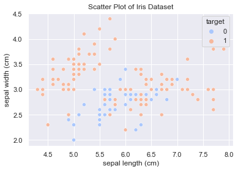
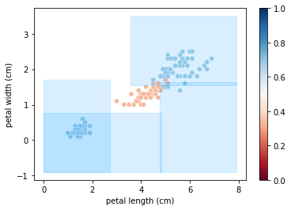
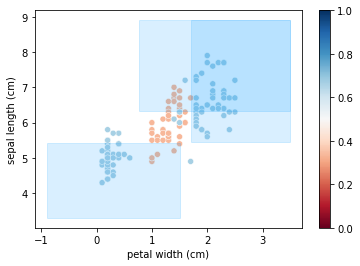

# InsideForest

InsideForest is a Python library for explainable tabular modeling with decision forests. It extracts rules from trained forests, prioritizes high-signal regions, assigns observations to interpretable segments, and generates human-readable descriptions of the patterns found in the data.

The core workflow is **supervised clustering**: the target variable guides the search for coherent regions instead of leaving the segmentation fully unsupervised. This makes the resulting clusters easier to connect to business outcomes, model behavior, and operational decisions.

The canonical estimators are now region clusterers. `InsideForestRegionClusterer`
builds general supervised regions and `InsideForestClassRegionClusterer` keeps the
complete class distribution of every selected physical leaf. The random forest
only generates candidate branches: `predict` returns cluster IDs and an
observation outside every region receives `-1`, never a forest fallback.

InsideForest is useful when you need more than a model score: it helps inspect why a forest separates classes, where a target concentrates, which conditions define useful segments, and how stable or efficient those explanations are across validation datasets.

## Example use cases

- Analyze customer behavior to identify profitable segments.
- Discover patient regions enriched for a clinical outcome.
- Evaluate marketing channels using website traffic.
- Build more accurate image-recognition systems.

## Benefits

Building and analyzing a random forest with InsideForest uncovers hidden trends and provides **insights** that support business decisions.

[OPEN THE USE CASE NOTEBOOK DIRECTLY IN COLAB](https://colab.research.google.com/github/jcval94/InsideForest/blob/master/InsideForest/examples/InsideForest_Caso_de_Uso.ipynb)

## Installation

```bash
pip install InsideForest
```

### From source

Clone the repository and install it manually:

```bash
git clone https://github.com/jcval94/InsideForest.git
cd InsideForest
pip install -e .  # or python setup.py install
```

For development dependencies, use the provided `requirements-dev.txt`:

```bash
pip install -r requirements-dev.txt
```

## Main dependencies
- scikit-learn
- numpy
- pandas
- matplotlib
- seaborn
- openai

## Basic workflow
The typical order for applying InsideForest is:
1. Train a decision forest or `RandomForest` model.
2. Use `Trees.get_branches` to extract each tree's branches.
3. Apply `Regions.prio_ranges` to prioritize areas of interest.
4. Link each observation with `Regions.labels`.
5. Optionally interpret results with `generate_descriptions` and `categorize_conditions`.
6. Finally, use helpers such as `Models` and `Labels` for further analysis.

## InsideForestRegionClusterer and InsideForestRegressor wrappers
For a simplified workflow you can use the `InsideForestRegionClusterer` or
`InsideForestRegressor` classes, which combine the random forest training and
region labeling steps:

Note: InsideForest is typically run on a subset of the data, for example using 35% of the observations and reserving the remaining 65% for other purposes.

```python
from sklearn.datasets import load_iris
from sklearn.model_selection import train_test_split
from InsideForest import InsideForestRegionClusterer, InsideForestRegressor

iris = load_iris()
X, y = iris.data, iris.target

# Train on 35% of the data and keep the rest for later analysis
X_train, X_rest, y_train, y_rest = train_test_split(
    X, y, train_size=0.35, stratify=y, random_state=15
)

in_f = InsideForestRegionClusterer(
    rf_params={"random_state": 15},
    tree_params={"mode": "py", "n_sample_multiplier": 0.05, "ef_sample_multiplier": 10},
)

in_f.fit(X_train, y_train)
pred_labels = in_f.predict(X_rest)  # cluster labels for the remaining data
assignments = in_f.assign_regions(X_rest)
quality = in_f.region_quality_report(X_rest, y_rest)
```

`InsideForestClassifier` remains as a deprecated compatibility name. Its
legacy `score` reports forest accuracy; the canonical region clusterer's
`score` reports adjusted mutual information for the returned cluster IDs.

For `InsideForestRegressor`, `predict(X)` also returns region labels. Use
`score(X, y)` for the underlying forest score, or call `regr.rf.predict(...)`
with a feature frame that matches the fitted forest when you need continuous
target estimates.

### Regression region validation

`experiments/validate_regression_regions.py` validates `InsideForestRegressor`
as an interpretable region extractor on Diabetes, Friedman1, a sparse linear
regression problem, and a nonlinear synthetic signal. The quick profile writes
raw metrics and a full report to
`experiments/results/regression_region_validation/`.

Latest local quick run:

- Median RF test R2: `0.6277`
- Median test rule coverage: `0.9008`
- Median known-region coverage: `0.7460`
- Median target-spread reduction inside regions: `0.5450`
- Median region-mean RMSE lift vs train-mean baseline: `0.1537`
- Classification-style target warnings: `0`

Reproduce with:

```bash
python experiments/validate_regression_regions.py --profile quick
```

### FAST presets and feature reduction

InsideForest can automatically pick faster training parameters and reduce
features based on dataset size:

```python
in_f = InsideForestRegionClusterer(auto_fast=True, auto_feature_reduce=True)
in_f.fit(X_train, y_train)
```

Use `explicit_k_features` to fix the number of retained features and
`fast_overrides` to tweak the automatic presets. After fitting, the
attributes `_feature_mask_`, `feature_names_in_`, `feature_names_out_`,
`_size_bucket_`, and `_fast_params_used_` reveal the applied settings.

You can control how final cluster labels are consolidated through the
`method` parameter. Available strategies are:

- `"select_clusters"`: direct rule-based selection (default)
- `"balance_lists_n_clusters"`: balance cluster assignments
- `"max_prob_clusters"`: favor clusters with higher probabilities
- `"menu"`: apply `MenuClusterSelector` to maximize an information-theoretic objective
- `"match_class_distribution"`: imitate the class proportions when assigning clusters
- `"chimera"`: compress class silhouettes and assign values with quota enforcement

After fitting, you can inspect the random forest's feature importances and
optionally visualize them:

```python
importances = in_f.feature_importances_
ax = in_f.plot_importances()
```

### Saving and loading models

Both `InsideForestRegionClusterer` and `InsideForestRegressor` include
convenience methods to persist a fitted instance using `joblib`:

```python
in_f.save("model.joblib")
loaded = InsideForestRegionClusterer.load("model.joblib")
```

The loaded model restores the underlying random forest and computed
attributes, allowing you to continue generating labels or predictions
without re-fitting.

## Use case (Iris)
The following summarizes the flow used in the [example notebook, which opens directly in Colab](https://colab.research.google.com/github/jcval94/InsideForest/blob/master/InsideForest/examples/InsideForest_Caso_de_Uso.ipynb). The notebook also contains a complete three-class region-clustering example using `InsideForestClassRegionClusterer`.

### 1. Model preparation

```python
from pyspark.sql import SparkSession
from sklearn.datasets import load_iris
from pyspark.ml.feature import VectorAssembler, StringIndexer
from pyspark.ml.classification import RandomForestClassifier
import pandas as pd

spark = SparkSession.builder.appName('Iris').getOrCreate()

# Load data into Spark
iris = load_iris()
df = pd.DataFrame(iris.data, columns=iris.feature_names)
df['species'] = iris.target

# Convert to Spark DataFrame and assemble features/labels
df = spark.createDataFrame(df)
indexer = StringIndexer(inputCol="species", outputCol="label")
assembler = VectorAssembler(inputCols=iris.feature_names, outputCol="features")
df = assembler.transform(indexer.fit(df).transform(df))

# Train the RandomForest model
rf = RandomForestClassifier(labelCol="label", featuresCol="features")
model = rf.fit(df)
```

```python
import seaborn as sns
import matplotlib.pyplot as plt

sns.scatterplot(x=df.columns[0], y=df.columns[1], hue='species', data=df,
                palette='coolwarm')
plt.show()
```



```python
from InsideForest import Trees, Regions, Labels
treesSP = Trees('pyspark', n_sample_multiplier=0.05, ef_sample_multiplier=10)
regions = Regions()
labels = Labels()
```

### 2. Obtaining branches and clusters

```python
pyspark_mod = treesSP.get_branches(df, 'species', model)
priority_ranges = regions.prio_ranges(pyspark_mod, df)
clusterized, descriptive = regions.labels(df, priority_ranges, False)
```

### 3. Visualization

```python
for range_df in priority_ranges[:3]:
    if len(range_df['linf'].columns) > 3:
        continue
    regions.plot_multi_dims(range_df, df, 'species')
```





The blue areas highlight the most relevant branches of the forest, revealing where the target variable concentrates.

### `Models`

```python
from InsideForest.models import Models

m = Models()
fp_rows, rest = m.get_knn_rows(df_train, 'target', criterio_fp=True)
param_grid = {'n_estimators': [50, 100], 'max_depth': [None, 5]}
cv_model = m.get_cvRF(X_train, y_train, param_grid)
```

Provides methods for retrieving critical observations with KNN and tuning a random forest with cross-validation.

### `Labels`

```python
from InsideForest.labels import Labels

lb = Labels()
branch_summaries = lb.get_labels(
    priority_ranges,
    df,
    target_var="target",
    max_labels=5,
    num_branches=3,
)

for branch in branch_summaries:
    for description, (score, population) in branch.items():
        mean_target, count = score
        print(f"{description} → mean={mean_target:.3f}, size={count}")
        print(population.head())
```

Generates descriptive labels for the branches and clusters obtained from the model.

### `plot_experiments`

```python
from InsideForest.regions import Regions
from sklearn.datasets import load_iris
import pandas as pd

# Example row from an experiments table
experiment = {
    "intersection": "[5.45 <= petal_length <= 8.9]",
    "only_cluster_a": "[-0.9 <= sepal_width <= 1.55, 4.75 <= sepal_length <= 6.0]",
    "only_cluster_b": "[1.0 <= petal_width <= 3.0, 1.7 <= sepal_width <= 3.3]",
    "variables_a": "['sepal_length', 'sepal_width']",
    "variables_b": "['petal_width', 'sepal_length', 'sepal_width']"
}

iris = load_iris()
df = pd.DataFrame(
    iris.data,
    columns=[c.replace(' (cm)', '').replace(' ', '_') for c in iris.feature_names]
)

regions = Regions()
regions.plot_experiments(df, experiment, interactive=False)
```

Compares clusters A and B using the rules provided by a row from the experiments table.

## Experiments

The canonical benchmark compares both region clusterers using coverage,
unmatched rate, AMI, NMI, ARI, homogeneity, completeness, purity, lift,
entropy, class coverage, stability, runtime, and memory. It includes cluster
`-1` and intentionally excludes RandomForest classification accuracy and
fallback behavior.

Execute the quick validation with:

```
python experiments/validate_class_region_clusters.py --profile quick
```

## License

This project is distributed under the MIT license. See [LICENSE](LICENSE) for details.

## Using OpenAI for descriptions
`generate_descriptions` from `InsideForest.descrip` uses the `openai` library. An API key is required either through the `OPENAI_API_KEY` argument or the environment variable of the same name.

Using the **Iris** example conditions you can generate automatic descriptions:

```python
from InsideForest.descrip import generate_descriptions
import os

iris_conds = [
    "4.3 <= sepal length (cm) <= 5.8 and 1.0 <= petal width (cm) <= 1.8"
]
os.environ["OPENAI_API_KEY"] = "sk-your-key"
res = generate_descriptions(iris_conds, OPENAI_API_KEY=os.getenv("OPENAI_API_KEY"))
```

You can also interact with the OpenAI API directly:

```python
from openai import OpenAI
import os

client = OpenAI(api_key=os.getenv("OPENAI_API_KEY"))
response = client.chat.completions.create(
    model="gpt-4o-mini",
    messages=[
        {"role": "system", "content": "You are a helpful assistant."},
        {
            "role": "user",
            "content": (
                "Summarize: 4.3 <= sepal length (cm) <= 5.8 and "
                "1.0 <= petal width (cm) <= 1.8"
            ),
        },
    ],
)
print(response.choices[0].message.content)
```

### `categorize_conditions`

```python
from InsideForest.descrip import categorize_conditions
from sklearn.datasets import load_iris
import pandas as pd

iris = load_iris(as_frame=True)
df = iris.frame
df['species'] = iris.target

categories = categorize_conditions(iris_conds, df, n_groups=3)
```

Generalizes numeric variable conditions into level-based categories.

### `categorize_conditions_generalized`

Offers the same generalization as `categorize_conditions` but accepts boolean columns.

```python
from InsideForest.descrip import categorize_conditions_generalized
from sklearn.datasets import load_iris
import pandas as pd

iris = load_iris(as_frame=True)
df = iris.frame
df['species'] = iris.target
df['large_petal'] = df['petal length (cm)'] > 4

bool_conds = [
    "large_petal == True and 1.0 <= petal width (cm) <= 1.8"
]
categories_bool = categorize_conditions_generalized(bool_conds, df, n_groups=2)
```

### `build_conditions_table`

Builds a tidy table with categorized conditions and their metrics.

```python
from InsideForest.descrip import build_conditions_table

effectiveness = [0.75]
weights = [len(df)]

table = build_conditions_table(bool_conds, df, effectiveness, weights, n_groups=2)
```

This produces a summary `DataFrame` where each condition is tagged by group along with the provided effectiveness and weight.

## Optimization utilities

InsideForest now includes a trust-region Newton optimizer for box-constrained problems. The helper function `_find_maximum` exposes an `optim_method` parameter to switch between standard gradient ascent and this trust-region approach, which uses analytic or finite-difference derivatives and typically converges in fewer evaluations while respecting bounds.

## Class-aware supervised region clustering

`InsideForestClassRegionClusterer` uses a random forest only to generate candidate branches. It associates every physical leaf with the class that maximizes purity, lift and coverage, then returns region-cluster IDs rather than class predictions.

```python
from InsideForest import InsideForestClassRegionClusterer

model = InsideForestClassRegionClusterer(
    rf_params={"n_estimators": 50, "random_state": 42},
    leaf_percentile=95,
    min_support=2,
)
model.fit(X_train, y_train)

cluster_ids = model.predict(X_test)
assignments = model.assign_regions(X_test)
regions = model.explain_regions(top_n=10)
class_regions = model.regions_for_class(y_train[0], top_n=5)
ambiguous = model.ambiguous_regions(top_n=10)
```

Rows outside every selected region receive cluster `-1`; there is no fallback to the forest's class prediction. `InsideForestMulticlassClassifier` remains temporarily available as a deprecated compatibility name. The detailed guide and clustering validation protocol are in [README.multiclass.md](README.multiclass.md).

## Tests

Latest test run:

```bash
pytest tests -q
```

```
98 passed
```

